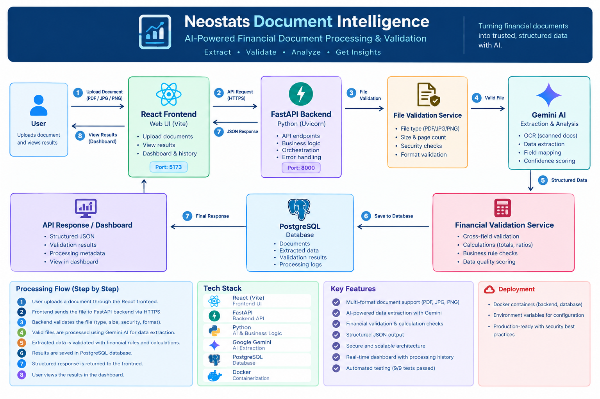

# Neostats Document Intelligence

AI-powered document intelligence platform for extracting, validating, and managing structured financial information from invoices, balance sheets, profit & loss statements, and cash flow statements.

## 🚀 Overview

Neostats Document Intelligence automates the processing of financial documents using **Google Gemini multimodal AI**.

Users can upload supported documents and receive structured financial data, line items, validation calculations, and persistent processing results through a web dashboard and REST API.

### Key Capabilities

* AI-powered financial document extraction
* PDF, JPG and PNG support
* Structured key-value and line-item extraction
* Financial validation and calculation checks
* PostgreSQL persistence
* REST API
* Swagger/OpenAPI documentation
* Interactive web dashboard
* Raw JSON results
* File validation and error handling

## 📄 Supported Documents

| Document            | Extracted Information                                                                   |
| ------------------- | --------------------------------------------------------------------------------------- |
| Invoice             | Invoice number, date, vendor, customer, subtotal, tax, discount, total and line items   |
| Balance Sheet       | Assets, liabilities, equity and financial line items                                    |
| Profit & Loss       | Revenue, COGS, gross profit, operating expenses, operating profit, tax and net profit   |
| Cash Flow Statement | Operating, investing and financing cash flow, opening cash, net change and closing cash |

## 🏗️ Architecture

```text
React Frontend
       │
       ▼
FastAPI REST API
       │
       ├── File Validation
       │
       ├── Gemini AI Extraction
       │
       ├── Financial Validation
       │
       ▼
PostgreSQL Database
```

### Architecture Diagram



## 🛠️ Technology Stack

### Frontend

* React
* Vite
* Axios
* JavaScript
* CSS

### Backend

* Python
* FastAPI
* SQLAlchemy
* Pydantic
* PyMuPDF
* Pillow

### AI

* Google Gemini Multimodal AI
* Google GenAI SDK

### Database & Infrastructure

* PostgreSQL
* Docker
* Docker Compose

### Testing

* Pytest
* FastAPI TestClient
* HTTPX

## 📂 Project Structure

```text
neostats-document-intelligence/
│
├── backend/
│   ├── app/
│   ├── tests/
│   └── requirements.txt
│
├── frontend/
│   ├── src/
│   ├── public/
│   └── package.json
│
├── docs/
│   └── architecture.png
│
├── sample_outputs/
│   ├── invoice.json
│   ├── balance_sheet.json
│   ├── profit_and_loss.json
│   └── cash_flow.json
│
├── test_dataset/
├── docker-compose.yml
├── .env.example
├── .gitignore
└── README.md
```

## 🔄 Processing Flow

```text
Upload Document
      ↓
File Validation
      ↓
Gemini Multimodal Extraction
      ↓
Structured JSON
      ↓
Financial Validation
      ↓
PostgreSQL Persistence
      ↓
API Response
      ↓
Frontend Dashboard
```

## 🔌 API

### Health Check

```http
GET /api/v1/health
```

### Process Document

```http
POST /api/v1/documents/process
```

Multipart form-data:

```text
file
document_type
```

Supported document types:

```text
invoice
balance_sheet
profit_and_loss
cash_flow_statement
```

### Get Document

```http
GET /api/v1/documents/{document_name}
```

### List Documents

```http
GET /api/v1/documents
```

### Swagger / OpenAPI

```text
/docs
```

## 🧮 Financial Validation

The application performs deterministic validation after AI extraction.

Validation results can include:

* Formula
* Operands
* Calculated value
* Reported value
* Variance
* PASS
* FAIL
* NOT_APPLICABLE

This provides transparent verification of extracted financial values.

## 🖥️ Frontend Screenshots

### Dashboard

<!-- Add Dashboard screenshot here -->

### Document Upload

<!-- Add Document Upload screenshot here -->

### Document Details

<!-- Add Document Details screenshot here -->

### Validation Results

<!-- Add Validation Results screenshot here -->

### Raw JSON

<!-- Add Raw JSON screenshot here -->

### Analytics

<!-- Add Analytics screenshot here -->

## 🧪 Testing

Automated tests cover:

* File validation
* Financial validation
* Extraction schema
* API flow

Current test result:

```text
9 passed, 2 warnings
```

## 🔐 Security

* API keys are stored using environment variables.
* `.env` is excluded from Git.
* `.env.example` is provided for configuration.
* File type and MIME type are validated.
* File size and page limits are enforced.
* Production deployment should use HTTPS, authentication, restricted CORS, and secure secret management.

## 🤖 AI Usage

Google Gemini multimodal AI is used for document understanding and structured information extraction.

Financial calculations are validated using deterministic application-side rules.

AI coding assistance was used during development for code generation, debugging, refactoring, testing, and documentation.

## 📊 Sample Outputs

Representative structured API responses are available in:

```text
sample_outputs/
```

These demonstrate the extraction and validation response format.

## ⚠️ Known Limitations

* AI extraction depends on Gemini API availability and quota.
* Dedicated OCR can be added for more challenging scanned documents.
* Production authentication and authorization are not currently implemented.
* Production deployments should add monitoring, rate limiting, and secure object storage.

## 🚀 Deployment

The deployed application is intended to provide:

* Public frontend URL
* Public backend API URL
* Public Swagger/OpenAPI URL

Secrets must be configured through the deployment platform and must never be committed to the repository.

## 👩‍💻 Author

**Dhedeepya Thakkilapati**

GitHub:
https://github.com/Dhedeepya123

Repository:
https://github.com/Dhedeepya123/neostats-document-intelligence
